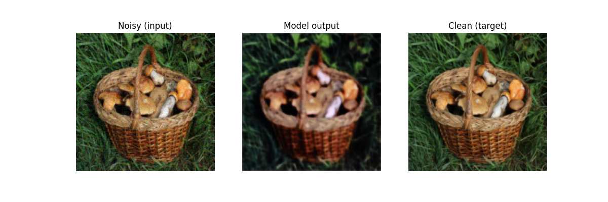
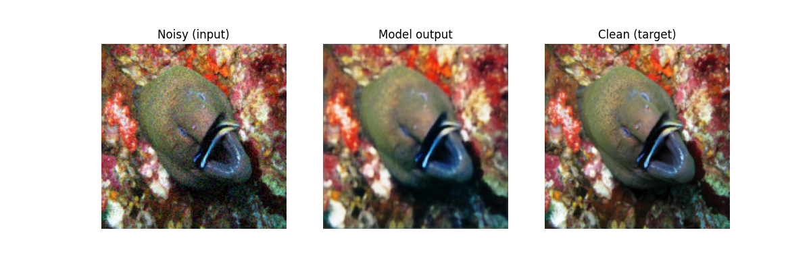

# Image Denoising U-Net

A U-Net based convolutional neural network that learns to remove synthetic Gaussian noise from images, restoring them to their clean version. Built from scratch in PyTorch, trained on Apple Silicon (MPS backend).

## Overview

This project reframes a segmentation-style U-Net into a **pixel-regression denoiser**:

- **Input**: an image with synthetic Gaussian noise added
- **Output**: the model's predicted clean version of that image
- **Target**: the original, unmodified image

The noisy/clean pairs are generated on-the-fly during training — clean images are loaded, a random-strength Gaussian noise pattern is generated and added, then the pair (noisy, clean) is fed to the model each epoch. This means every training pass sees a fresh noise pattern and strength for the same base images.

## Architecture

- Encoder-decoder U-Net with skip connections
- Down path: 4 stages with feature sizes `[64, 128, 256, 512]`, each a `DoubleConv` block (`Conv2d → BatchNorm2d → ReLU`, twice) followed by max pooling
- Bottleneck: `DoubleConv(512, 1024)`
- Up path: transpose convolutions for upsampling, concatenated with the matching skip connection, followed by `DoubleConv`
- Final layer: `1x1 Conv2d` mapping to 3 output channels (RGB), passed through `sigmoid` to keep outputs in `[0, 1]`

## Data Pipeline

- Images resized, then a random crop is taken for patch-based training (helps a small dataset go further)
- Gaussian noise added with a randomly sampled sigma (strength) per sample, scaled to match the `[0, 1]` tensor range
- Result clamped back to valid pixel range `[0, 1]`

## Training

- Loss: `MSELoss` (pixel-wise regression, not classification)
- Optimizer: Adam
- Device: MPS (Apple Silicon) with CPU fallback
- Train/val split via `random_split`, no overlap between the two

## Requirements

- Python 3
- `torch`, `torchvision`
- `numpy`
- `Pillow`
- `tqdm`
- `matplotlib` (for visualizing results)

## Usage

```bash
python noise_reg.py
```

Update `image_dir`, `max_image`, `noise_range`, and `crop_size` in the `ImageDataset` instantiation to match your dataset.

## Output

Example result — noisy input, model's denoised prediction, and the original clean image side by side:




## Notes / Future Improvements

- Currently trained on a small (100-image) dataset with patch-cropping and per-sample noise randomization to increase effective training variety
- Could be extended with additional noise types (Poisson, speckle) or a wider noise sigma range for more robust generalization
- Could be extended into a full diffusion-style model by adding noise-level (timestep) conditioning to the network
